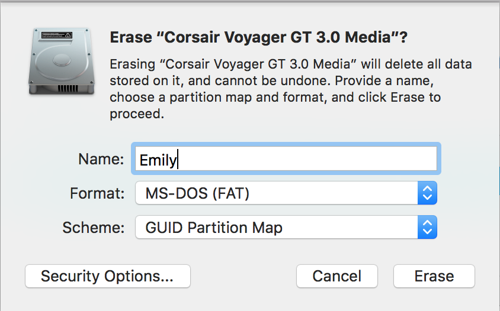
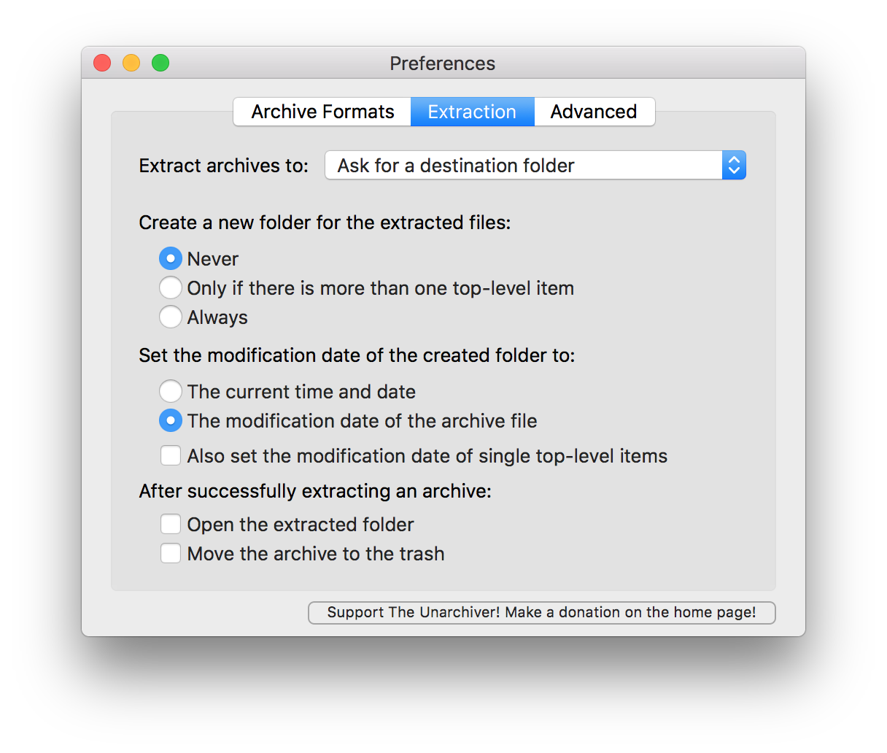
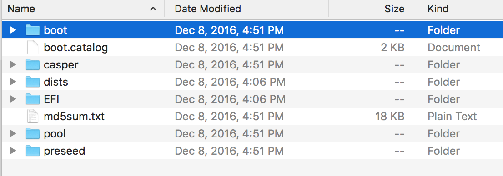
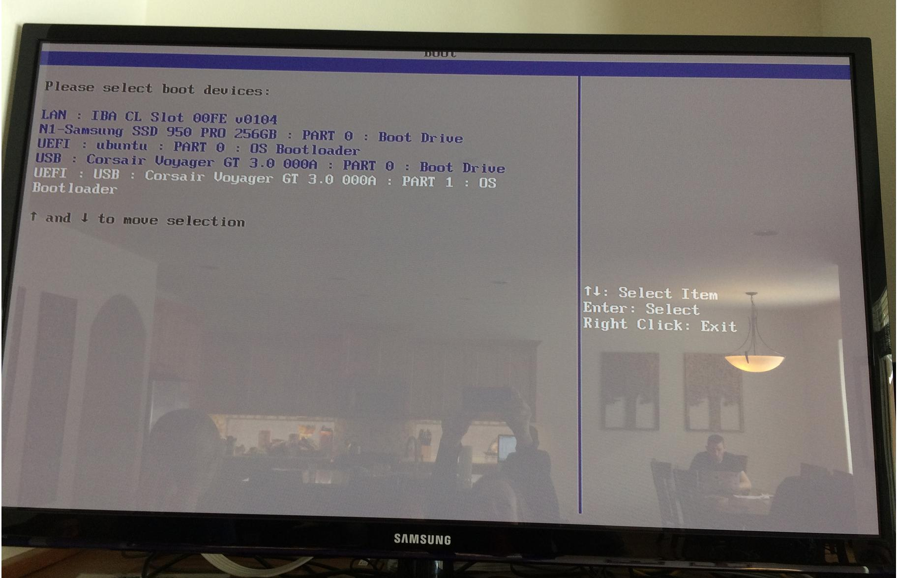

Interested in getting a POSM? This involves a little bit of DIY, but advanced tech skills are **not** required. This site has instructions that walk through the whole process.

First, you order the hardware kit (you'll have to assemble a few things). Next, you load the core software onto the device for a first-time install. This transforms the unit into a POSM. After that, the POSM is ready to go and can be used over and over again.

## Anatomy of a POSM
### Hardware
We used the following hardware components for the original version of POSM, which cost about $300 in total:

* [NUC Kit - BOXNUC5PPYH](http://smile.amazon.com/gp/product/B00XPVQHDU) - 2.6
  GHz quad core Pentium (N3700, 6W TDP). Includes a basic case.
* [Samsung 850 EVO 250GB](http://smile.amazon.com/gp/product/B00OAJ412U)
* [8GB 1600MHz DDR3L CL9 SODIMM](http://smile.amazon.com/gp/product/B00KQCOTCM)
* [Wireless N Dual Band + Bluetooth 4.0 M.2 NGFF Combo Card](https://www.thinkpenguin.com/gnu-linux/wireless-n-dual-band-bluetooth-40-m2-ngff-combo-card) This is needed if you plan to have more than 14 devices connected at a time. Replace the stock wireless card with this.

If you want to be able to use the OpenDroneMap feature in POSM, then you will want a slightly more souped-up set up hardware with greater processign power. Instead of the NUC unit above, order the following, somewhat more expensive model:

* [NUC kit - BUC6i7KYK](https://www.google.com/search?q=nuc+intel&oq=nuc+intel&aqs=chrome..69i57j0l5.1791j0j7&sourceid=chrome&ie=UTF-8#tbm=shop&q=Intel+Next+Unit+of+Computing+Kit+NUC6i7KYK+Barebone+Computer&spd=5256604869261291450)

### Software

Once you've ordered and assembled the components, you'll load the device with a core software package that transforms it into a POSM. The package includes the core POSM software, all of the tools that POSM supports, and other downloads/apps to support mapping and mobile data collection.

The POSM download is [here](http://posm.s3.amazonaws.com/releases/posm-0.6.1.iso) and instructions are in the following section.

For developers: the POSM software is free, open-source, and available through the [American Red Cross' GitHub repository](https://github.com/AmericanRedCross/posm) with technical documentation and a variety of other resources. If you want more technical info or a less GUI-oriented means of setting this up, then head over to GitHub.

### Other things you will need

The POSM hardware is basically a mini-computer. To set it up for the very first time, you'll need to plug in the following:

* USB keyboard
* external monitor
* USB stick (minimum 4 GB)

You'll also need an internet connection with an ethernet cable to load an area of interest onto the POSM and set it up for the field.

## First-time install

First, download the [core POSM software](http://posm.s3.amazonaws.com/releases/posm-0.6.1.iso). This will download with the file name `posm-0.6.1.iso`. You need to move that onto a USB stick and extract it into a set of folders, but first you'll have to change the USB formatting.

### Configuring the USB stick

#### Mac
On a Mac, plug in your USB stick and open Disk Utility. Navigate to the USB stick and click "Erase".

Give the USB stick a name. Set the format to `MS-DOS (FAT)` and the scheme to `GUID Partition Map`. Then click "Erase", which will delete all existing USB contents and reformat the drive to make it compatible with the POSM. See below:

#### Windows

On a PC, connect the USB drive, then go to "Computer" or "My Computer", right-click the drive and select "Format…" from the menu. Set the drive to FAT.

### Moving and extracting the POSM download (AKA "ISO file") onto the USB stick

If you don't use command line, then moving the POSM download bundle involves downloading a file extractor to extract it (we use [The Unarchiver](https://itunes.apple.com/us/app/the-unarchiver/id425424353?mt=12) for Mac or [7-Zip](http://www.7-zip.org/) for Windows).

On a Mac, open The Unarchiver and navigate to the `Extraction` tab. Where it says "Create a new folder for the extracted files", select `Never`. The reason we do this is because the POSM download has to be extracted and moved onto the USB stick. Most file extractors will place extracted files into an overall folder. The POSM unit can't handle this, and you can't just manually move everything one level up because there are hidden files that will get missed.

Use your extraction client (The Unarchiver or 7-Zip) to extract the download (`posm-0.6.1.iso`) onto the USB stick... again, making sure that the files do not end up in an overall folder. On a Mac, you do this by right-clicking the `posm-0.6.1.iso` file and selecting `Open with...` ... `The Unarchiver`. Set the destination folder to the USB stick and press "Extract".

The contents of your USB stick should look like this:

### POSM first-time install

Alright, you're finally ready. Take the Intel NUC unit that you've assembled and plug in an external monitor, a keyboard, and the USB stick you've prepared. Turn the power on.

You'll see a boot screen appear on your monitor. Press `F10` when prompted. You'll have to be quick on the draw with this because the prompt only lasts a few seconds. If you miss it, then just turn the power off and try again.

[need: prompt screen image]

This will open a menu (see below) where you have to select which device to boot from. Use the arrow keys to select your USB stick, then hit enter.

[need: better version of this photo]

That's it. The software will install onto the NUC unit, transforming it into a POSM. This takes a few minutes. When it's complete, you'll see the following screen and you can safely power down the POSM:

[need: complete screen image]

Note: if you ever want to wipe and reinstall the core POSM software (to install a new version, etc), then it's the same process - prep the USB stick, plug in the monitor etc, and press `F10` when prompted. The NUC unit will overwrite the existing software with the new download.
