This section walks through the different POSM features: Editing OSM, Field Papers, OpenDataKit and OpenMapKit (including setting up mobile data collection on Android phones, OpenDroneMap, key downloads, and the admin interface.

## Planning fieldwork in general

Aside from the technology itself, there are a number of things that need to be considered for mapping fieldwork: the size of the area, number of enumerators needed and time required, the data required and the data model for collecting it, etc. There's also a lot of nuance in teaching people (especially in other languages/cultures) how to use different mapping tools. There are a variety of resources (including presentation and training materials) on the [Missing Maps website](www.missingmaps.org) which may be useful. You can also reach out to the <a href="mailto:contact@posm.io">American Red Cross GIS team</a> in advance and, if we have time, we may be able to talk through your project and provide suggestions from past experiences.

## Editing OSM

### Paper-based field mapping (Field Papers)

[Field Papers](http://fieldpapers.org/) creates a grid of atlas pages for an area which you can print off and use to walk around the target area and annotate the paper map with missing buildings, address points, and any other relevant features. Afterwards, you take a photo or scan each page and Field Papers will use the QR code on each atlas page to georeference the area - it will appear as a semi-transparent layer in iD editor or JOSM and you will need to digitally trace your edits into the existing OSM data. The process is largely self-explanatory and documented in the actual Field Papers app.

Creating an atlas (we usually size these so that a single page is no larger than a few city blocks):
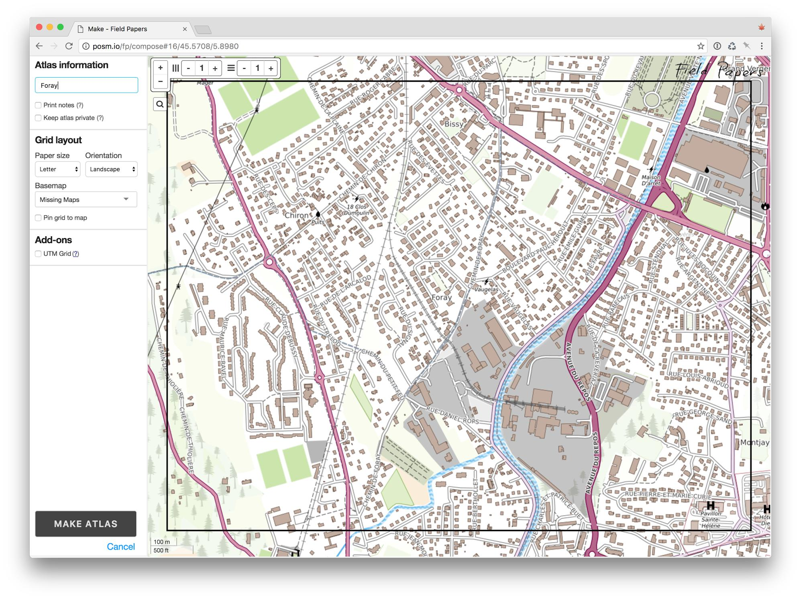

Example of atlas page (we print these in black and white to save money/ink):
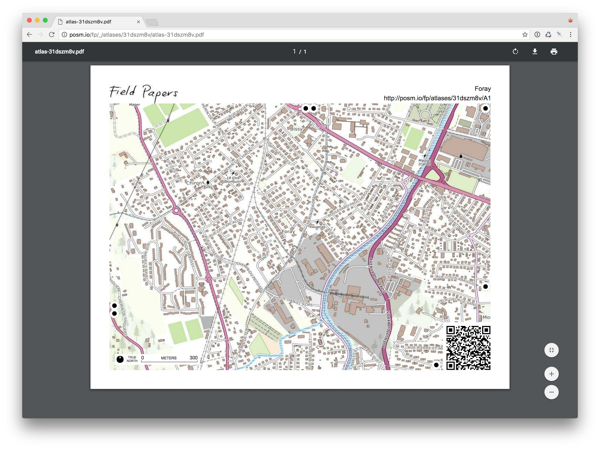

Field Papers being used to record addresses in Dhaka, Bangladesh:
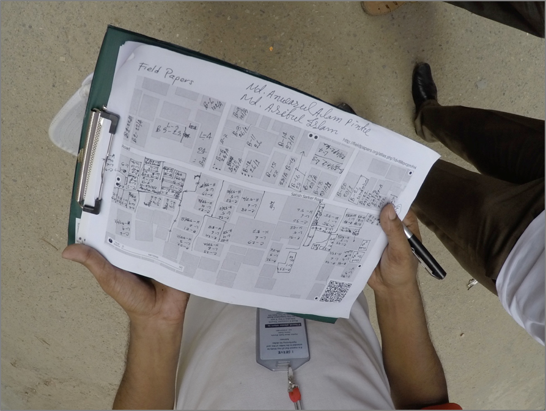

Field Papers has some great advantages. It's great in areas where there may be missing features (like buildings) that need to be added into OSM, or where you want maximum flexibility for what information you want to collect. We also use Field papers mapping in areas where security is a big concern and using smartphones would make volunteers targets for theft. The main disadvantage of Field Papers is that the data entry afterwards can be time-consuming, we often notice spelling mistakes or other inconsistencies afterwards that require more time to clean, and it can sometimes be difficult to enumerators to orient themselves into the space on the map. For this reason, we prefer using digital tools like OpenMapKit.

### Mobile data collection

There's a variety of different apps and tools to support mobile data collection and mapping in the field. We prefer OpenDataKit (ODK) and OpenMapKit (OMK). We often find ourselves doing fieldwork where we have to collect the same pieces of information for all the buildings, schools, etc in an area, and OMK is designed to make this process fast and easy.

#### Setting up the phones

In terms of hardware, we use Blu Advance 5.0 phones. We’ve tried a lot of different phones in the field, and the Blu’s are our favourite so far - cheap, hardy, easy to use, and they have a reliable GPS signal.

Regardless of what type of phone you're using, you will need to download the ODK and OMK apps. These are available through the posm.io homepage - simply connect your phone to the POSM wifi to access them.

POSM contains several other apps that can help with field mapping:
* [OsmAnd](http://osmand.net/). This app provides oflfine maps and is extremely useful for wayfinding and orientation. We also use this for planning travel and recording [volunteers' tracks](http://www.missingmaps.org/blog/2017/01/07/gps-tracks/) during fieldwork.
* [OpenSignal](https://opensignal.com/). This runs in the background to record cell phone signal strength when the home screen is in use. You can download the data from the phones to see how the signal varied in your fieldwork area, and the data goes into OpenSignal's crowdsourcing database.)
* [AppLock](https://play.google.com/store/apps/details?id=com.domobile.applock&hl=en). If you're providing the phones and/or SIM cards for fieldwork, then you may want to be able to control which apps can be used by enumerators and which cannot.

#### Setting up a form for OpenDataKit or OpenMapKit

Before you can use OpenDataKit/OpenMapKit, you need a survey form. There's some documentation on the OpenDataKit website, but here's a working example as well:

This is a [basic buildings form](https://docs.google.com/spreadsheets/d/11H4-mGYTS61GLjSbVoTbmhoI5DjlF5fcBwNwQcvd2Go/edit#gid=1817602041_) that we use. It contains three tabs: survey, osm, and settings (which you can ignore).

The "survey" tab contains a series of ODK question types, most of which are recorded in the background (e.g. start time, end time, date of survey, device ID, etc.). The "osm building tags" question tells  ODK to launch the OpenMapKit app and to move to the "osm" tab in the workbook and look for the "building_tags" question.

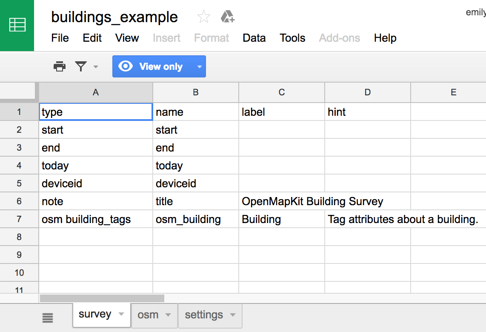

First, make any additions to the question types you need and what you want to call them. Then, move to the "osm" tab. Here's how it works:

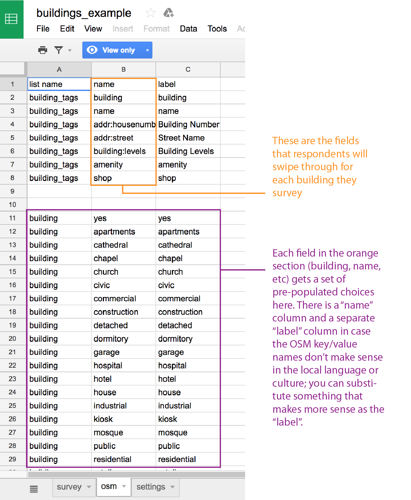

What this looks like: an enumerator will open ODK to conduct a survey. After recording all the background information (start time, etc), ODK will hit the "osm" question type and prompt the user to launch OpenMapKit. At this point, the user will see a map interface with his/her GPS location and the OSM buildings/features surrounding him/her. When the user taps on a building, they will see all the OSM tags that currently exist for that building. They will then swipe through the survey, which contains one screen for each of the fields in the orange box (building, name, etc). Each of those fields will have pre-populated choices from the purple box. These correspond to OSM key:value pairs, but may be labeled differently in order to make sense to the user.

If you need help deciding what key:value pairs you need to record (and how to classify things appropriately based on context), the [OSM wiki](http://wiki.openstreetmap.org/wiki/Main_Page) and [TagInfo](https://taginfo.openstreetmap.org/) are both great resources. We are currently adding these into the POSM core tools to make them available offline.

Once you've set up your ODK/OMK form, save it as a `.xls` or `.xlsx` (Excel) workbook. Access the posm.io homepage, navigate to OpenMapKit (where you'll see the existing forms and can access their submissions and the XLSX form that was used to create them). Click the three dots at the top-right of the screen and select "Upload form".

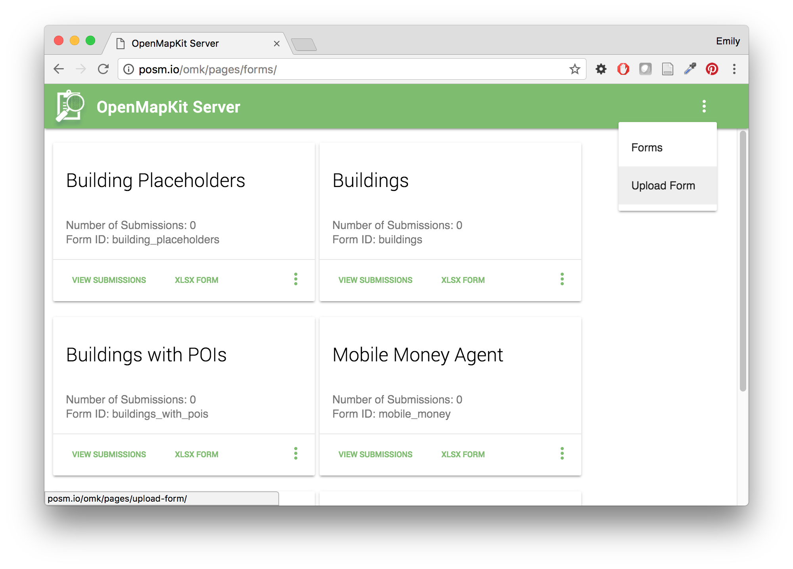

You can then drag and drop your ODK Excel form to upload it. When it's done, you'll see it added to the grid of forms in the main OpenMapKit Server menu.

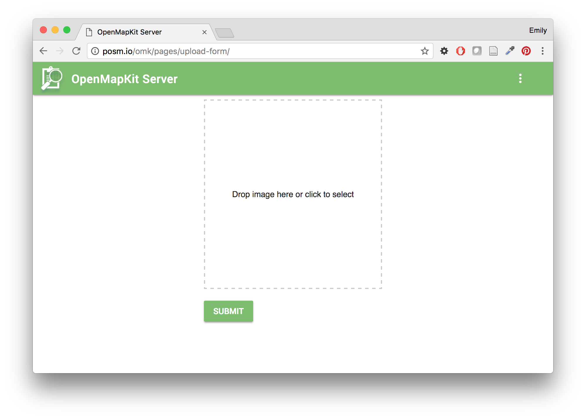

### Using ODK/OMK on the phones

The first time you use a phone for a mobile data collection project, you have to get the survey deployment set up - this means map tiles, OSM data, and the ODK/OMK form itself.

First, make sure your phone is connected to the POSM wifi. Launch OpenDataKit (you always use OMK through ODK; you will never launch it from the OMK app). You'll see this menu:

Tap the three dots at the top-right of the screen and select "General settings":

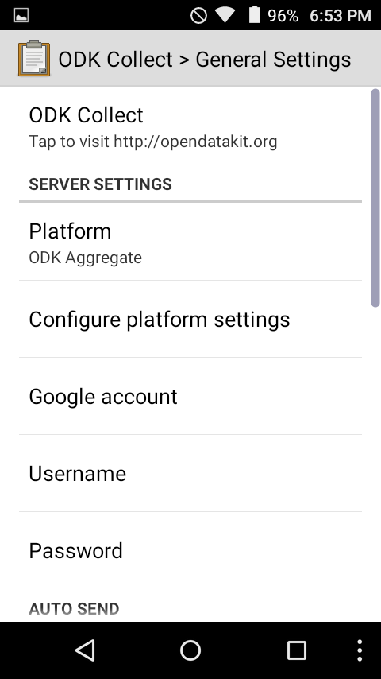

We have to tell the ODK app to connect to the OMK server, where it will find all the forms and will upload its responses. To do this, tap "Platform settings", and you'll see this menu:

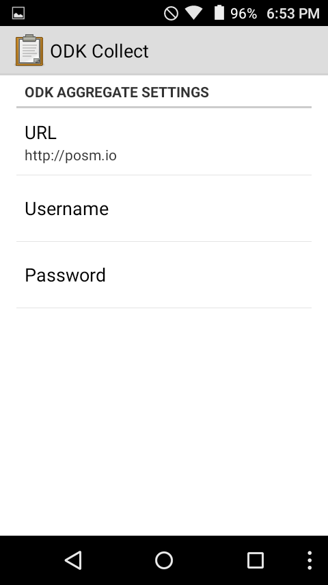

Set the URL to `http://posm.io`. You have to do this the first time you set up the phone; after that, it will remember where to point.

On the same "General settings" screen, scroll down to the options for "Auto send" and make sure that there is a check next to "Auto send with wifi" and **not** next to "Auto send with network". Since we're doing this offline, we only want the forms sent over the POSM wifi.

Now that the server settings are right, go back to the ODK home screen and select "Get blank form". The app will connect to the OMK server on POSM and show you all the forms that have been uploaded. Only get the ones you need - otherwise your ennumerators may get confused later.

To use ODK, go to the ODK home screen and tap "Fill blank form", then select the form you want to complete. This launches the ODK survey and, in turn, prompts you to launch OpenMapKit.

You may see this screen when you launch OMK for the first time:

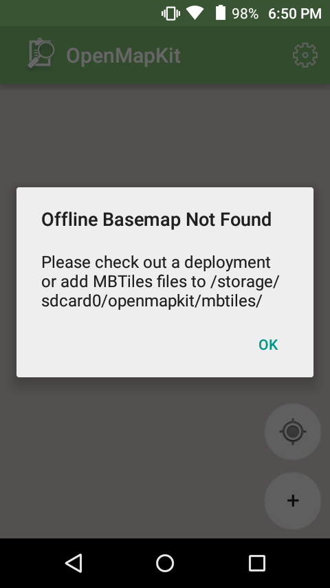

This is because you need to load the deployment. Tap the gear icon at the top-right of the screen and select "Deployments". You should see a list of any deployments that are on your POSM (items get added to the list when you load a OSM export onto the POSM). Tap on the deployment you want to load, and you'll see a list of what files are available:

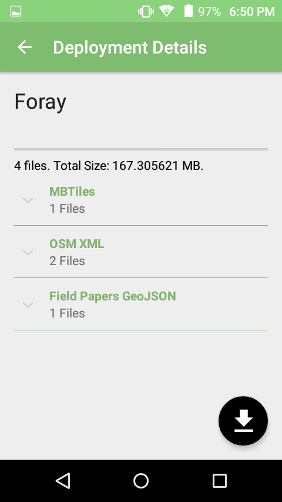

Tap the download button on the bottom-right to download all of these files. When the download has finished, tap on the map button on the bottom-right - you'll see a map of the deployment:

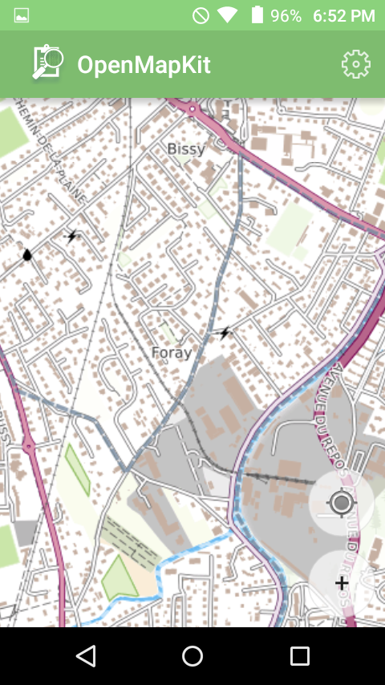

You can zoom into the deployment to select a building and complete the OMK survey for it. (If you have any problems, tap the gear icon again and select "OSM XML Layers", and make sure your layers are turned on.) Tapping on a building will show the existing OSM data for that feature:

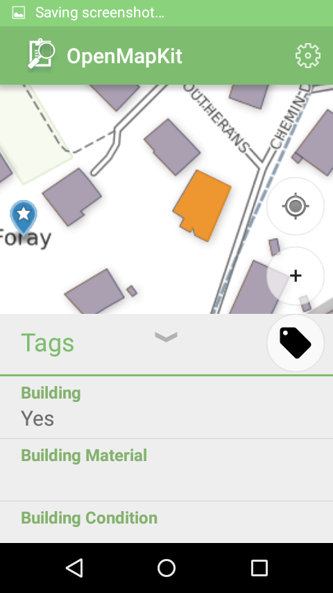

Press the tag button to complete the OMK survey, swiping through the different fields from the OMK form you prepared:

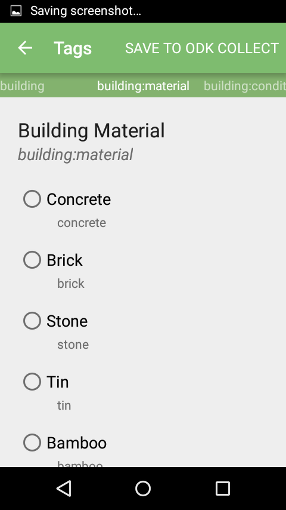

When you've finished, you'll be prompted to save the OMK data:

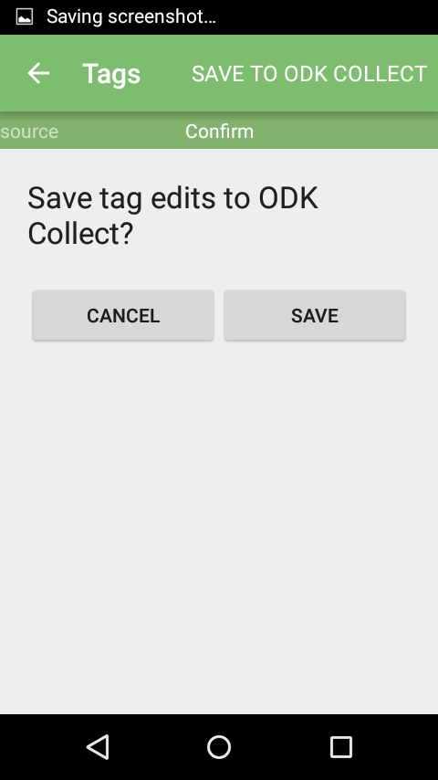

You will need to enter your OSM username for this. Then, back in ODK, you need to save the form and exit the survey:

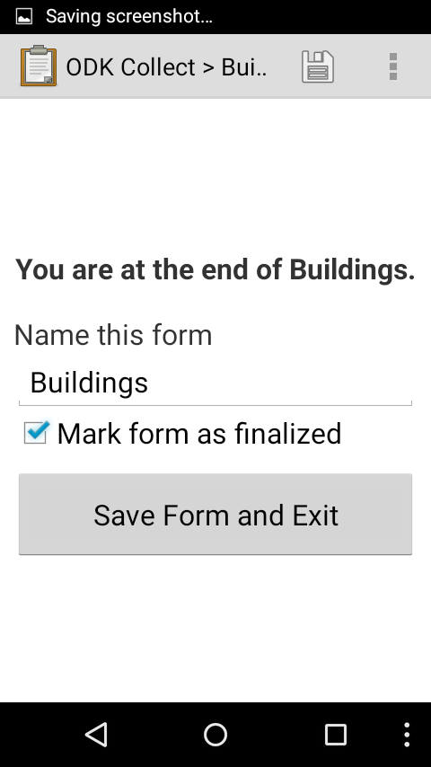

Pressing this button completes the survey and saves the data locally. It will auto-send to the server when it connects to POSM, then delete the local copy.

#### Manually pushing data from phones to POSM

If for some reason the completed forms do not automatically send to POSM, then you can push them manually. In the home screen for ODK, press the "Send finalized forms" button. There will be a number in parentheses which indicates how many unsent forms are on the device:

### Tying it all together

Once you've walked through this workflow on the phones to set them up, then they are tested and ready for field use. You will need to complete and save an ODK/OMK form for every OSM feature that you survey, and can push these to the POSM during/after fieldwork.

### Working with data collected through ODK/OMK

#### Viewing data and submitting to OSM

Cleaning data: borrow from Matt's post: https://github.com/AmericanRedCross/workflows/blob/master/west-africa_data-cleaning.md

#### Cleaning data

For large amounts of data, there are certain tools and processes that can streamline data cleaning.

We documented our [data cleaning workflow](https://github.com/AmericanRedCross/workflows/blob/master/west-africa_data-cleaning.md) for a project in West Africa. This is project-specific but my provide more detailed instructions.

Here's a short summary:

1. Retrieve the `.osm` file from OMK server and open in JOSM. Enable the ToDoList and OpenData plug-ins for JOSM.
2. Purge non-relevant features (features that don't need to be cleaned, or features outside a geographic area where you want to focus) using `CRTL+Shift+P`. **Do not delete these features**.
3. Save the points and polygons as separate files.
4. For point data: Clean any free-form text inputs. When entering data for things like hospital names, town names, etc, enumerators sometimes use different spelling of capitalization or include a typo. Use Open Refine to clean these columns individually. Open Refine looks for responses that are close but not exactly the same, and allows you to group these and change them to a consistent spelling. Once you're finished, export as a `.csv` file and re-open in JOSM (`File -> Open`, accept the coordinate system as WGS84). Make sure the points appear to be in the correct place, add a source tag to all your new features (e.g. `source=Red Cross field survey`), then push the changes to OSM.
5. For polygon data: This is more tedious. Open Refine doesn't play nice with XML input, so in the past we've cleaned the individual records in JOSM. There's room here for scoping out other data cleaning services or scripts that might make it easier to convert from XML into a format that can be digested through Open Refine and back again. Once you've cleaned the polygons, add the source tag (see step 4), address any validation errors that occur, and push to OSM.
6. Save the `.osm` files you uploaded, for future reference.

These steps will push changes to the OSM data kept on your local POSM. This means that you can create new Field Papers, OMK surveys, etc, which will incorporate these changes for future rounds of mapping.

The local OSM copy is still separate from the online version, however, and will need to be reconciled and synched when you return from the field to an area with internet connectivity.
